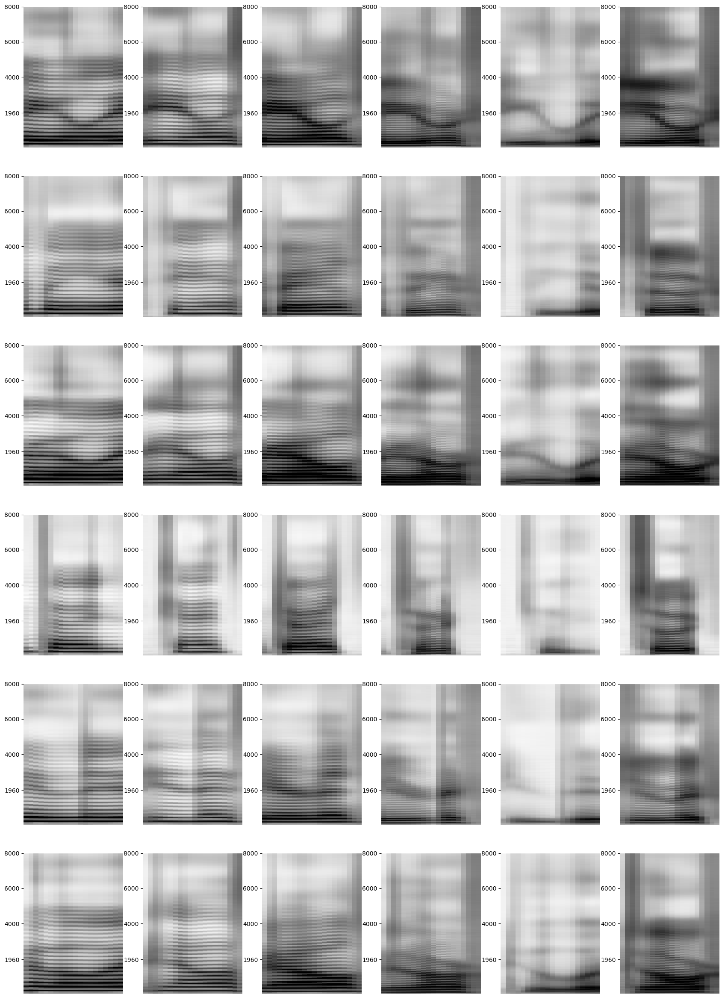
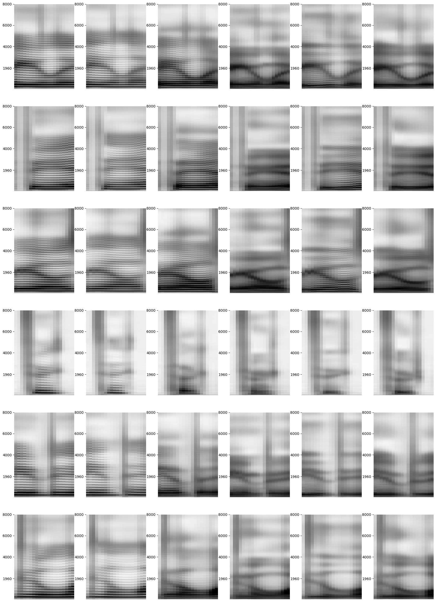
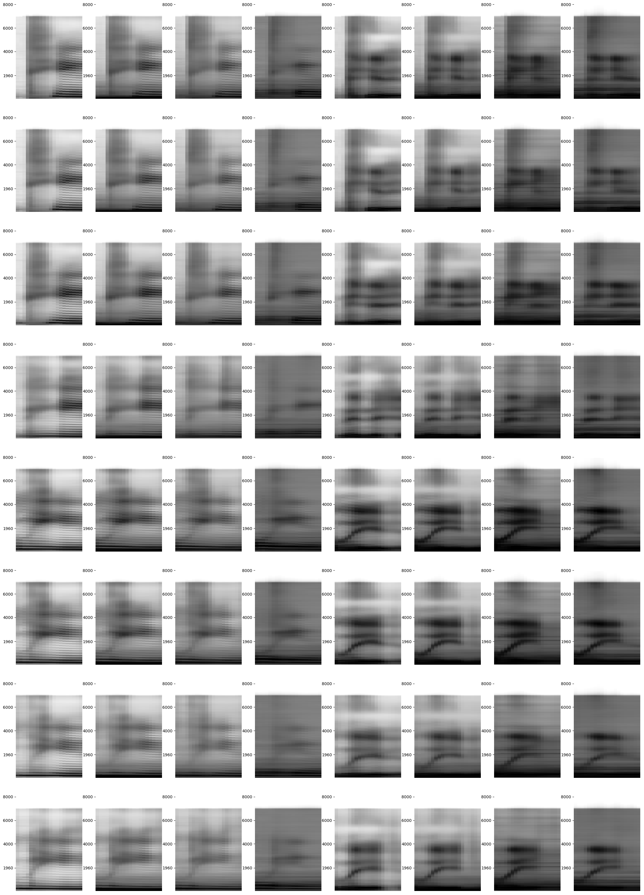
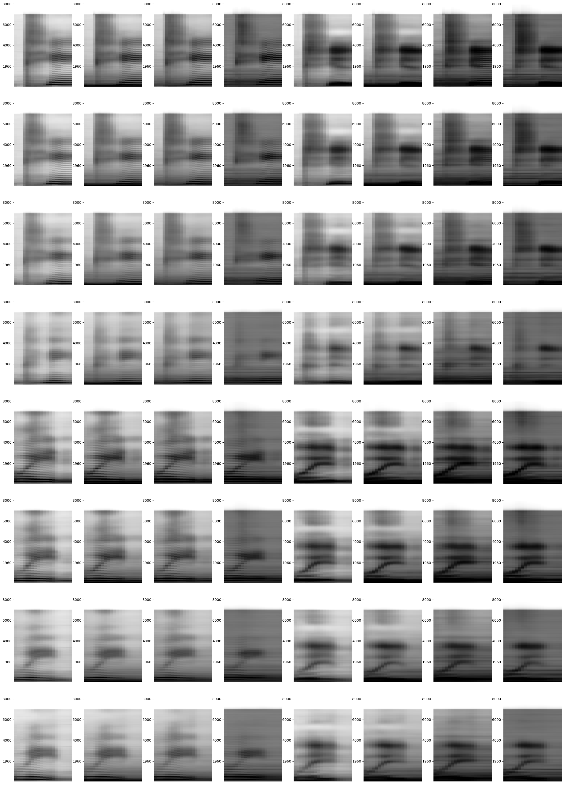
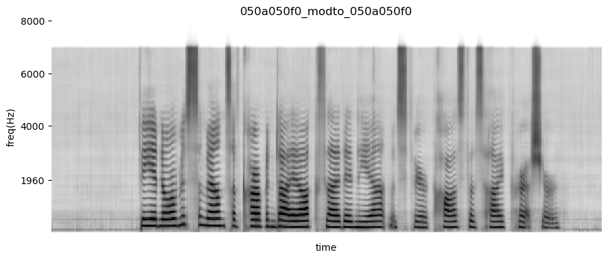
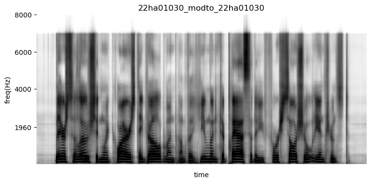
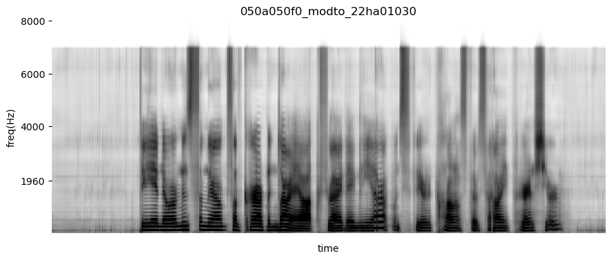
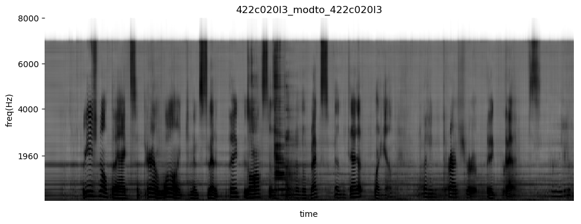
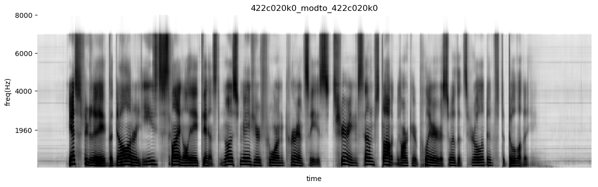
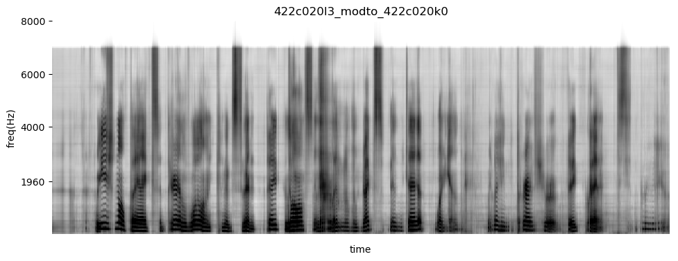

# Factorized Hierarchical Variational Autoencoders
This repository contains the code to reproduce the core results from the paper 
[Unsupervised Learning of Disentangled and Interpretable Representations from Sequential Data](https://arxiv.org/abs/1709.07902).

To cite this work, please use
```
@inproceedings{hsu2017learning,
  title={Unsupervised Learning of Disentangled and Interpretable Representations from Sequential Data},
  author={Hsu, Wei-Ning and Zhang, Yu and Glass, James},
  booktitle={Advances in Neural Information Processing Systems},
  year={2017},
}
```

# Dependencies
This project uses Python 2.7.6. Before running the code, you have to install
* [Tensorflow 1.0](https://www.tensorflow.org/)
* [Scipy](https://www.scipy.org/)
* [Numpy](http://www.numpy.org/)
* [CFFI](http://cffi.readthedocs.io/en/latest/)
* [Soundfile](https://pysoundfile.readthedocs.io/en/0.9.0/)
* [Matplotlib](http://matplotlib.org/)
* [Kaldi](https://github.com/kaldi-asr/kaldi)
* [Kaldi-Python](https://github.com/janchorowski/kaldi-python/)

The former 6 dependencies can be installed using pip by running
```
pip install -r requirements.txt
```

The last one requires Kaldi before a specific commit (`d1e1e3b`). If you don't have 
Kaldi before that version, you can install both Kaldi and Kaldi-Python by running
```
make all
```

# Usage
The code structure follows Kaldi's convention. Scripts for each dataset can be found in
`egs/<dataset>` folder. If you have questions, please write an email to wnhsu@csail.mit.edu

## TIMIT
To reproduce the experiments for TIMIT, run:
```
# stage = -1 for data preparation; run only once.
cd egs/timit
./run_fhvae.sh --TIMIT_RAW_DATA <timit_raw_data_dir> --stage -1
```

## Aurora-4
Before running FHVAE experiments, you need to have the following Kaldi data directories 
of Aurora-4 prepared: 
`<aurora4_kaldi_egs_dir>/data/{train_si84_clean, train_si84_multi, dev_0330, test_eval92}`.

To reproduce the experiments for Aurora-4, run:
```
# stage = -1 for data preparation; run only once.
cd egs/aurora4 
./run_fhvae.sh --AURORA4_KALDI_EGS <aurora4_kaldi_egs_dir> --stage -1
```

# Experimental Results

## A. Visualizing Factorization
We show the combination of 6 latent sequence variables and 6 latent segment variables.
The latent sequence variable for each column is the same; likewise, the latent segment variable
for each row is the same.

### TIMIT (alpha = 0)


### TIMIT (alpha = 10)


### Aurora-4 (alpha = 0)


### Aurora-4 (alpha = 10)


## B. Utterance-Level S-Vector Modification
We show replacing S-vector of a target utterance with that of a reference utterance 
to alter the sequence-level attribute, which can be applied to speaker conversion or denoising. 
The FHVAE model used for following modifications is trained on Aurora-4 with alpha = 0

### converting a female speaker to a male speaker
#### source utterance


#### reference utterance


#### S-vector-replaced source utterance


### removing background restaurant noise
#### source utterance


#### reference utterance


#### S-vector-replaced source utterance


